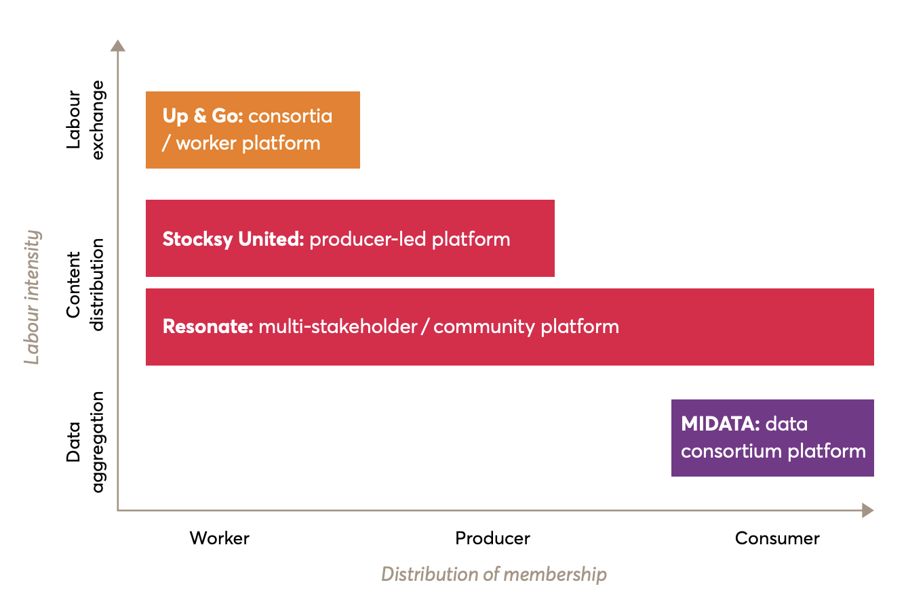

# Commons Research

We build ****commons tech, changing tragedy into festival by realigning incentives.

## The co-operative advantage \[[1](https://media.nesta.org.uk/documents/Nesta_Platform_Report_FINAL-WEB_b1qZGj7.pdf)\]

This fundamental difference enables co-operative businesses to generate long term, tangible economic and social advantages:

* Co-operatives have been shown to be more productive than conventional businesses, often due to workers being more engaged with their organisation, with stronger levels of trust and more effective knowledge sharing. \(Perotin 2016\)
* Figures show co-operative start-ups are almost twice as likely to survive their first five years when compared to traditional companies. \(Co-operatives UK 2018\)
* Co-operatives have been shown to have lower levels of staff turnover, lower pay inequality, and lower absenteeism rates compared with other businesses. \(Mayo 2015\)

## Types of co-operative business \[[2](https://media.nesta.org.uk/documents/Nesta_Platform_Report_FINAL-WEB_b1qZGj7.pdf)\]

There are five broad types of co-operative business, distinguished by the different membership types they offer.

| Membership Type | Example |
| :--- | :--- |
| **Worker and freelance co-operatives** – controlling majority sits with the workers of the enterprise. | Suma is the UK’s largest worker co-operative. It produces vegetarian, organic, ethically-sourced products. |
| **Consumer co-operatives** – membership is based on the customers of the co-op. | The Wine Society is a co-operative organisation specialising in supplying fine wines, owned by its customers. |
| **Consortia co-operatives** – independent producers, usually small businesses, form a co-operative to benefit from collective organising, such as finance or insurance services. | Thames Valley Farmers’ Market Co-operative manages and promotes farmers’ market in towns across Berkshire, Oxfordshire and South Buckinghamshire, enabling farmers and small producers to sell their produce directly to local consumers. |
| **Community co-operatives** – members align based on a shared ‘community identity’, which can be associated with a place or an interest. | Lewes Football Club was one of the first entirely fan-owned clubs in the UK. Supporters can invest in the organisation on the basis of one member, one vote. |
| **Multi-stakeholder co-operatives** – there is a hybrid of stakeholder interests which leads to creating specific roles and rights for the various types of members. | The New Internationalist Magazine is a multi-stakeholder co-operative, owned both by its workers and 3,500 consumerinvestor-members. |

### Platform Co-Operatives

| Type | Example |
| :--- | :--- |
| **Multi-stakeholder / community platform** is the clearest example of a platform co-operative: users and the producers of the products / services facilitated by the platform, and the platform developers themselves, all come together as memberowners. There is a blurring of the characteristics that have distinguished the community and multi-stakeholder co-ops in traditional co-operatives. This is due to platform features which build a common interest around members’ shared needs. However, they will have a specific interaction that will categorise their stakeholder identity, e.g. producer, consumer. These relationships will be reflected within representative structures of governance – or engaged through open membership, on equal terms for all stakeholders. | Resonate is a stream-to-own music platform harnessing blockchain technology. It is a multistakeholder co-operative giving democratic control to artists \(45%\), listeners \(35%\) and workers \(20%\). Through its model, it pays up to 2.5 times more revenue to artists than other streaming services. |
| **Producer-led platform** Geographically dispersed producers who collectively sell their produce through a digital platform. The producers are member-owners that drive the governance of the co-operative but often don’t work together. The aggregation and alignment of interests is purely on the producer side with no option for consumers to become co-owners. The platform is often critical in supporting producers’ livelihoods and relies on producers’ participation to create network effects to drive trade. | Stocksy United provides curated stock photography and video footage with almost 1000 photographer member-owners, across 63 countries. The members license creative content and receive 50% royalties on standard license sales and 75% on extended license sales – they also receive dividends which equated to $300,000 in 2016 on $10.7m in sales. |
| **Consortia / worker platform** A format that enables greater interaction between worker co-operatives – rather than among autonomous producers. Ultimately, the platform is providing the channel for the workers to provide their services but they engage closely, often in specific localities. | Up & Go is a platform that offers on-demand cleaning services at guaranteed fair wages launched by four worker co-operatives, based in New York City. The worker-owned cleaning businesses, which are all majority women owned, earn 95% of the cost of every Up & Go cleaning job. The remaining 5% supports the costs to maintain the platform |
| **Data consortia platform** Another potential variant is the idea of a mutual trust model, mainly focused around the ownership and use of data. The basis for such a model is that “data subjects would pool their data forming a trust, stipulating conditions under which data could be shared...large enough to be effective partners in controlling how \[the data is used\]” \(Lawrence, 2016\). Accordingly, a mutual organisation is formed to manage the data on behalf of its members, who have both democratic control and an equitable share in its profits. While the starting point here is around the ownership of data, there are applications of such an approach that more closely resemble the commercial features of a platform co-op. | MIDATA are a health data co-operative based in Switzerland that enables their members to upload their medical records, mobile-health data and personal genome and can then decide to securely share this data with health professionals and researchers. The platform allows patients to collectively and efficiently make use of their data with profits generated from the voluntary sale of data to researchers. |

Source: [Platform Co-Ops](https://media.nesta.org.uk/documents/Nesta_Platform_Report_FINAL-WEB_b1qZGj7.pdf) \(p 17-20\)

## Orgs in space

* [Nesta](https://nesta.org.uk) – backs new ideas to tackle the big challenges of our time, from the pressures of an ageing population to stretched public services and a fast changing jobs market.
* [Cooperative UK](https://www.uk.coop/) – the network for thousands of co-operative businesses, Co-operatives UK works to promote, develop and unite member-owned business worth £36 billion to the UK economy
* Community Shares Unit \(CSU\)
* CoLab Co-op
* International Co-operative Alliance

## Misc

* Open Conference

